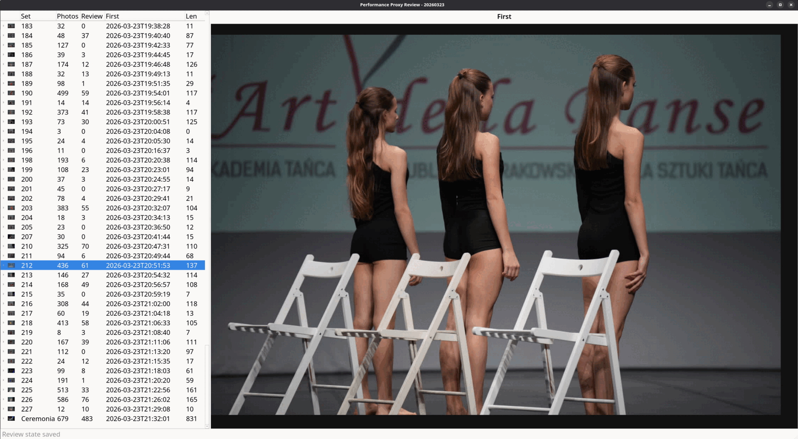
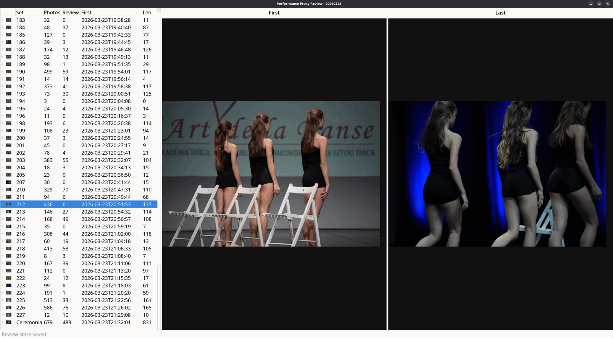

# Vocatio

`vocatio` is a CLI event media workflow focused on stream synchronization and set detection: it aligns photo and video streams in time, transcribes audio from video, extracts announcements, and builds performance/set timelines for review and final export.

The pipeline covers:

- media metadata export and merge
- multi-camera video sync estimation
- WhisperX transcription
- announcement candidate extraction (rule-based or semantic)
- performance timeline building
- photo-to-performance assignment
- proxy generation and manual review
- final reviewed-set export (photo/video)

## Repository Layout

- `scripts/pipeline/` - all operational pipeline scripts
- `conf/` - export profiles for reviewed set delivery
- `docs/PROJECT_INTENT.md` - product direction

## Requirements

- Python 3.10+
- `ffmpeg` and `ffprobe`
- `exiftool`
- `whisperx` (for transcription scripts)
- `PyYAML`, `rich`, `PySide6`
- ImageMagick (`magick`) for JPG proxy/export conversion paths

Install Python dependencies in your preferred environment, then run scripts directly with `python3`.

## Data Model (Per Day)

The pipeline runs per `day_dir` (one event day at a time), for example:

If you process multiple days, run the same sequence for each directory.

```bash
/data/20260323
```

By default, generated artifacts are written to:

```bash
DAY/_workspace
```

You can override this with `--workspace-dir`.

## Expected Day Directory Structure

Example under `/data/DAY/`:

- `/data/20260323/p-a7r5/`
- `/data/20260323/v-a7r5/`
- `/data/20260323/v-gh7/`
- `/data/20260323/v-pocket3/`
- `/data/20260323/_workspace/`

Prefix meaning:

- `v-...` = video stream
- `p-...` = photo stream
- `_workspace/` = generated pipeline artifacts (CSV, JSON, transcripts, proxies, review state)

The pipeline discovers stream directories using these prefixes.


## Pipeline Outputs (Default Filenames)

Main workspace artifacts:

- `merged_video.csv`
- `sync_map.csv`
- `sync_diagnostics.csv`
- `merged_video_synced.csv`
- `transcripts_manifest.csv`
- `announcement_candidates.csv` or `announcement_candidates_semantic.csv`
- `performance_timeline.csv`
- `photo_assignments.csv`
- `photo_review.csv`
- `photo_unassigned.csv`
- `photo_assignment_summary.csv`
- `photo_proxy_manifest.csv`
- `performance_proxy_index.json`
- `review_state.json`

Directories:

- `transcripts/`
- `proxy_jpg/`

## Recommended Execution Order

Replace `DAY` with your day directory path.

### 1. Export per-stream media metadata

```bash
python3 scripts/pipeline/export_event_media_csv.py DAY
```

### 2. Merge video CSV rows

```bash
python3 scripts/pipeline/merge_event_media_csv.py DAY --media-type video
```

### 3. Estimate sync map between video streams

```bash
python3 scripts/pipeline/estimate_video_sync_map.py DAY
```

### 4. Apply sync corrections

```bash
python3 scripts/pipeline/apply_video_sync_map.py DAY
```

### 5. Transcribe synced videos (WhisperX)

```bash
python3 scripts/pipeline/transcribe_video_batch.py DAY --all-streams
```

### 6A. Extract announcement candidates (rule-based)

```bash
python3 scripts/pipeline/extract_announcement_candidates.py DAY --all-streams
```

### 6B. Extract announcement candidates (semantic, optional)

```bash
python3 scripts/pipeline/extract_announcement_candidates_semantic.py DAY --all-streams
```

If you use semantic output, pass it explicitly in the next step:

```bash
python3 scripts/pipeline/build_performance_timeline.py DAY --candidates-csv DAY/_workspace/announcement_candidates_semantic.csv
```

### 7. Build performance timeline

```bash
python3 scripts/pipeline/build_performance_timeline.py DAY
```

### 8. Assign photos to timeline intervals

```bash
python3 scripts/pipeline/assign_photos_to_timeline.py DAY
```

### 9. Generate proxy JPG files

```bash
python3 scripts/pipeline/generate_photo_proxy_jpg.py DAY --all-streams
```

### 10. Build per-performance proxy index

```bash
python3 scripts/pipeline/build_performance_proxy_index.py DAY
```

### 11. Review assignments in GUI

```bash
python3 scripts/pipeline/review_performance_proxy_gui.py DAY
```

This step creates or updates `review_state.json`.

Example GUI views:





### 12. Export one reviewed set

```bash
python3 scripts/pipeline/copy_reviewed_set_assets.py DAY out 158 --config conf/copy_reviewed_set_assets.default.yaml
```

Where:

- `out` is the target root directory
- `158` is the final set name (number or text label)

## Export Profiles

Available profiles:

- `conf/copy_reviewed_set_assets.default.yaml`
  - photo: converted JPG (max edge 3200, quality 90)
  - video: converted MP4 (H.264/AAC), default end padding 10s
- `conf/copy_reviewed_set_assets.raw.yaml`
  - photo/video copied as raw sources

Use with:

```bash
python3 scripts/pipeline/copy_reviewed_set_assets.py DAY out SET_NAME --config conf/copy_reviewed_set_assets.raw.yaml
```

## Semantic Tooling (Optional)

Additional semantic and benchmark scripts:

- `build_semantic_announcement_demo.py`
- `demo_semantic_announcement_classifier.py`
- `benchmark_semantic_announcement_models.py`

Use these for model experiments and benchmark runs, not for the minimal production flow.

## Useful Checks

Inspect per-script options:

```bash
python3 scripts/pipeline/export_event_media_csv.py --help
python3 scripts/pipeline/build_performance_timeline.py --help
python3 scripts/pipeline/copy_reviewed_set_assets.py --help
```
